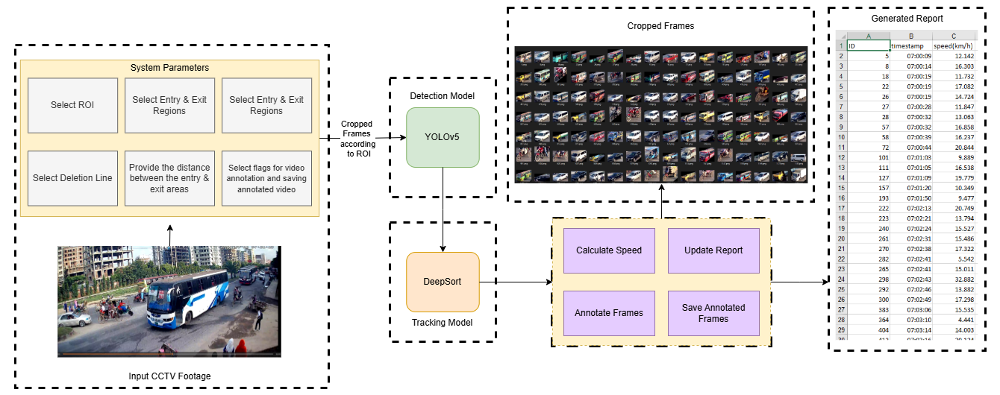
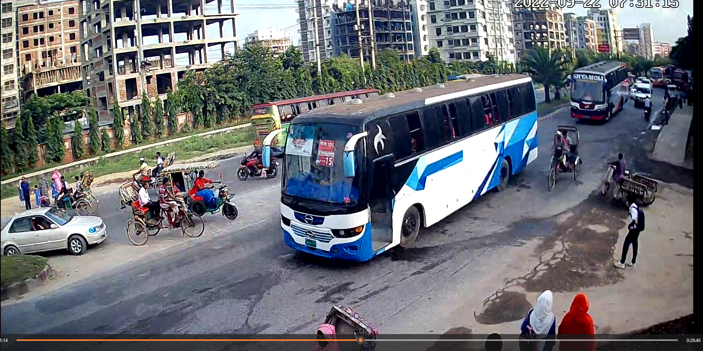
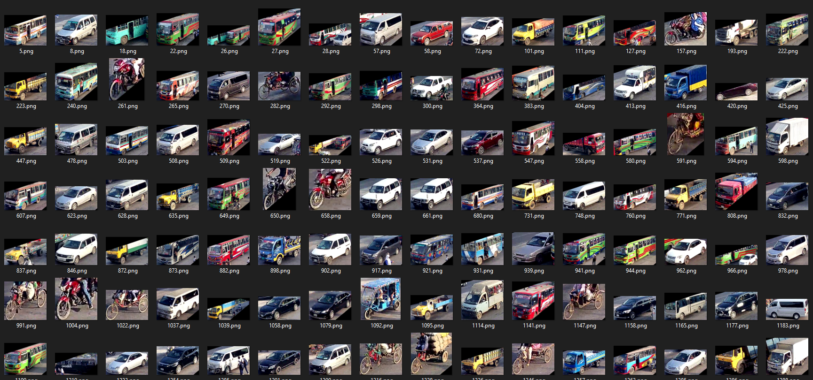
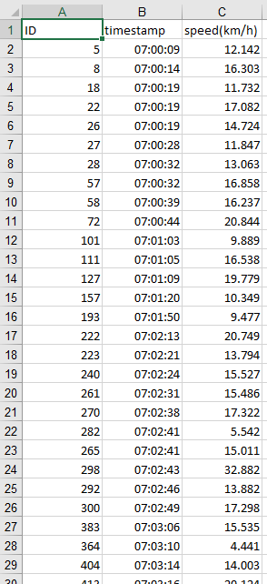

<div align="center">

# VeloTrack: A Vehicle Speed Analysis System

</div>

<p align="center">
    <a href="https://ishmamt.github.io/"><strong>Ishmam Tashdeed*</strong></a>
    ·
    <a href="https://scholar.google.com/citations?user=t3ZFXwsAAAAJ&hl=en"><strong>Md Taukir Azam Chowdhury*</strong></a>
</p>

<div align="center">

[](https://github.com/ishmamt/VeloTrack/)
</div>

---

<p style="text-align: justify;">
VeloTrack is a vehicle speed analysis system designed to estimate vehicle speeds from CCTV footage. This repository contains the tools and code necessary to process video, detect vehicles, track their movement, and calculate their speed. The system also aims to document relevant details about the vehicles observed, providing a comprehensive analysis of traffic flow and potential speed violations.
</p>

## Overview of VeloTrack Framework

<p align="center">

</p>

The different features of VeloTrack – 
- **Detecting Vehicles:** Can detect multiple types of vehicles in a cluttered environment
- **Vehicle Tracking:** Tracks each instance of a vehicle, assigning a unique identifier to them
- **Predicting Vehicle Speed:** Finds vehicle speed from the captured frames and detection and tracking results
- **Producing Comprehensive Report:** Logs each entry and creates a comprehensive report

## Input and Output of the Framework

The system takes a CCTV video footage such as:
<p align="center">

</p>

And produces **two** outputs:
- Cropped frames containing a vehicle along with it's unique identifier
- Comprehensive report containing the speed of each vehicle
<p align="center">
  
</p>
<p align="center">
    
</p>

## Installation

This repository is tested on `Python 3.8`. Create a virtual environment to install all the dependencies.

1. To install `torch` visit the <a href="https://pytorch.org/get-started/locally/">PyTorch</a> website and follow the instructions.
2. Install `requirements.txt` file running the command:
   
      ```
      pip install -r requirements_cuda.txt
      ```

## Video Folder

⚠️ Ensure that you have the video in the `Data` folder. ⚠️

## Setting Road Parameters

The following parameters must be set in `main.py` from the input video before executing the program-
- Add the ROI (Region of Interest) co-ordinates to further optimize the system
- Add the co-ordinates for the entry, exit, and deletion areas from the CCTV footage
- Add the distance between the entry and exit areas

## Execution

To run the framework, execute the following command:
```
python main.py
```

## Results

The resulting `.csv` file contains each vehicle's identifier, timestamp, and speed.

## Acknowledgement

The vehicle detection framework uses components from <a href="https:/github.com/ultralytics/yolov5">YOLOv5</a> and the vehicle tracking framework uses components from <a href="https:/github.com/nwojke/deep_sort">DeepSort</a>

## Citation
```
@misc{Tashdeed_VeloTrack_2023,
author = {Tashdeed, Ishmam and Chowdhury, Md Taukir Azam},
title = {{VeloTrack: A Vehicle Speed Analysis System}},
version = {1.1},
year = {2023},
publisher = {GitHub},
journal = {GitHub repository},
url = {https://github.com/ishmamt/VeloTrack}
howpublished = {\url{https://github.com/ishmamt/VeloTrack}}
}
```
